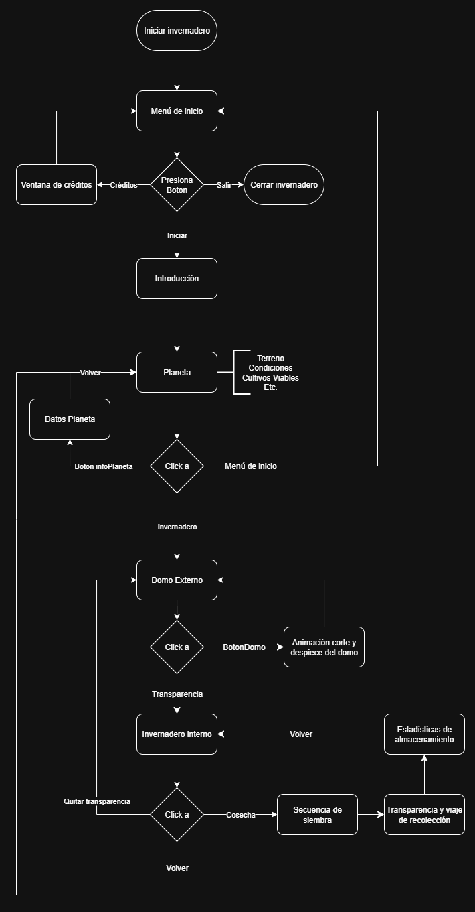
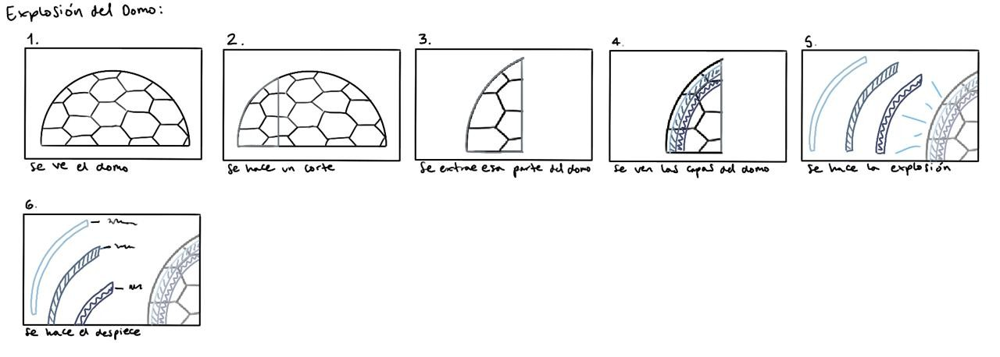

# VisualizacionFinal

## Integrantes

- Michael Zapata
- Juan Sebastián Mieles
- Hannah Bryan
- Maria José Galindo

## Primeras ideas

1. Juego de granja dentro de un **invernadero** del espacio (estética *solar punk*)
2. Robot de envíos interplanetario (Tipo **Wall-e**) adaptación a condiciones extremas
3. Caparazón exo-robótico de entrenamiento (Como el que usa **Gokú y Roshi**)
4. Mazo adaptable elemental

#### Idea #1: Invernadero

##### Mecanismos por diseñar:

- Control de humedad.
- Sistemas de ventilación.
- Control de humedad.
- Cámara Fitosanitaria o de desinfección.
- Sistemas de riego.
- Control de plagas.
- Modular en un planeta con cráteres donde cada cráter tiene un invernadedro y están conectados por una serie de túneles.

> **Moodboard**
> 
> 
> 
> 
> 
> 

> **Links útiles**
> - [Artículo sobre invernaderos fuera del planeta](https://tecnoagro.com.mx/2022/07/26/invernaderos-para-la-luna-marte-y-otros-planetas/)
> - [Diseño de plantaciones en la luna](https://www.aenverde.es/ingenio-espanol-para-plantar-el-primer-invernadero-en-la-luna/)
  
#### Idea #2: Robot de envíos interplanetarios

- Videojuego de robot de envíos modular
- Adaptar al personaje con diferentes elementos para viajar por diferentes areas 
> **Bocetos**
> 

> **Moodboard**
> 
> 

#### Idea #3:  Caparazón exo-robótico

- Caparazón que permite adaptar al usuario a diferentes condiciones
- Cubierta de protección
- Cubierta de temperatura

> 
> 
---

# GreenSpace

## Desarrollo idea invernadero

> **Investigación:**
>
> - [Artículo sobre invernaderos fuera del planeta](https://tecnoagro.com.mx/2022/07/26/invernaderos-para-la-luna-marte-y-otros-planetas/)
> - [Diseño de plantaciones en la luna](https://www.aenverde.es/ingenio-espanol-para-plantar-el-primer-invernadero-en-la-luna/)
>
> 

> _Estudio de herramientas de visualización de datos_
> 
> 

 

**[Arquitectura de datos (Prueba vieja)](https://app.xmind.com/share/GtxsXyOp?xid=YOesyLLW)**

**[Arquitectura de datos (Nueva versión)](https://viewer.diagrams.net/?lightbox=1&highlight=0000ff&nav=1&title=ArquitecturaInvernadero&dark=auto#Uhttps%3A%2F%2Fdrive.google.com%2Fuc%3Fid%3D17g2YHbO9tuEGWbcMfCWcwmXAD8XiVf8k%26export%3Ddownload)**

 

> _Prueba de arquitectura de forma más visual_ 
> 
> 

> _Arquitectura Final_ 
> 
> 

 

> **Guión infográfico:**
> 
> Empezamos la visualización con un menú de inicio donde se ven 3 botones y un planeta oscuro rotando a su lado.
> 
> Si se presiona el botón de salir se cierra la aplicación.
> 
> Si se presiona el botón de créditos se muestra la cinemática de créditos y luego regresa al inicio.
> 
> Si se presiona el botón de iniciar se inicia la cinemática de introducción donde se da una breve descripción del proyecto seguido por datos relevantes del planeta donde vamos a simular la exploración de los invernaderos.
> 
> Luego de la introducción se hace un despiece del planeta, hay un botón que permite hacer un corte del planeta para ver las rutas y caminos internos del planeta y un botón para ver la cronología de las estaciones y visualizar en qué momento del año estamos.
> 
> Si se da click al invernadero que hay activado por medio de la georeferenciación se hace un acercamiento al mismo donde se muestra de mejor manera las partes de este.
> 
> Se permite visualizar las componentes del domo por medio de una explosión y despiece donde se evidencia el regulador de luz, de temperatura, de ventilación, etc.
> 
> Hay un slider donde se puede hacer transparencia del domo y acceder a los elementos dentro del invernadero. 
> 
> Al darle a una plantación se inicia la secuencia de siembra donde se le muestra al usuario los pasos a seguir para este proceso, seguido de una transparencia en los tubos donde se muestra el proceso de recolección y almacenamiento.
> 
> Ya en la zona de almacenamiento se muestran con una simulación de gráficos de barras cuanta cosecha se tiene de cada tipo y hay un botón  para regresar al invernadero e ir a las demás zonas.
> 
> ~~Al darle a la zona de limpieza y desinfección, se mostraría por medio de una explosión y despiece las diferentes partes que componen los elementos de la ducha y zona de desinfección para luego volver al invernadero.~~ (Opcional)

---

### WireFrames y Storyboards

#### Wireframe de introducción

#### Wireframe de secuencia, transparencia y georeferenciación

#### Storyboard de corte domo

#### Storyboard de corte planeta

### Moodboards

**[Link de figma](https://www.figma.com/board/MIE1GjCLSxgF18wi7tu9yV/Greenspace?node-id=0-1&t=fntQOpoKVYrK1nyC-1)**
#### Moodboard de modelado

#### Moodboard de iconografía

#### Moodboard de fuentes

#### Estudios tipográficos y GUI

**[Link a Canva](https://www.canva.com/design/DAGoJDVaSXs/PF2KkxQj8O_NQLTLEjGL4g/view?utm_content=DAGoJDVaSXs&utm_campaign=designshare&utm_medium=link2&utm_source=uniquelinks&utlId=h161edeccff)**

### Bocetos lenguaje visual

#### Boceto botones

### Pruebas

[Link a pruebas de unity](https://play.unity.com/en/games/b9e95931-232f-4551-ba47-335adfede6ea/v01-visualizacion)

> Pruebas modelo planeta
> 